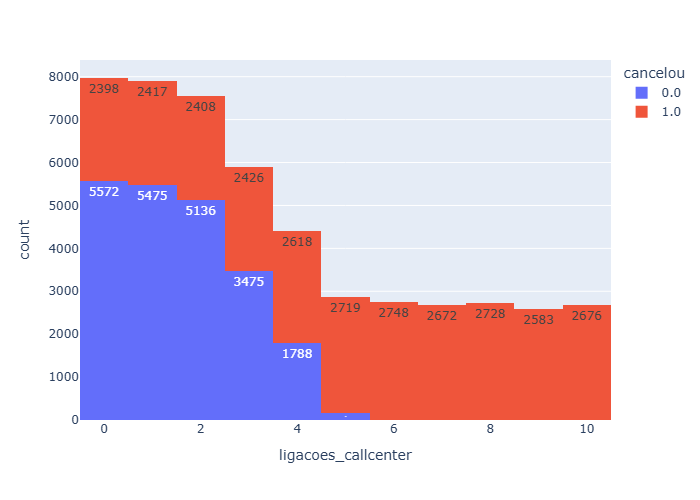
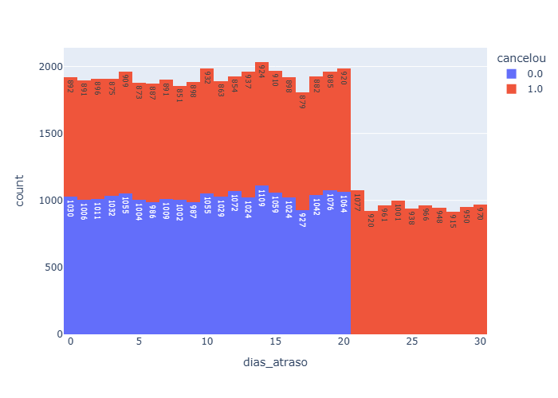

# Análise de Cancelamento de Clientes (Churn Analysis)

Este projeto consiste em uma análise de dados utilizando **Python** para entender os principais fatores que levam clientes a cancelar um serviço.

A empresa possui uma base com mais de **800 mil clientes** e percebeu que grande parte deles está cancelando o serviço. O objetivo da análise foi identificar **padrões associados ao cancelamento** e propor possíveis ações para reduzir esse problema.

---

# Problema de negócio

Uma alta taxa de cancelamento pode gerar diversos impactos negativos para a empresa, como:

- perda de receita  
- aumento do custo de aquisição de novos clientes  
- redução do crescimento da empresa  

Por isso, entender **quais fatores levam ao cancelamento** é essencial para criar estratégias de retenção de clientes.

---

# Tecnologias utilizadas

- Python  
- Pandas  
- Matplotlib  
- Seaborn  
- Jupyter Notebook  

---

# Etapas da análise

1. Importação da base de dados em CSV  
2. Limpeza e tratamento dos dados  
3. Análise exploratória dos dados  
4. Identificação de padrões de cancelamento  
5. Proposição de ações para reduzir o churn  

---

# Gráficos da análise

## Cancelamento por tipo de contrato

## Cancelamento por número de ligações no call center

## Cancelamento por atraso de pagamento

---

# Principais problemas identificados

Durante a análise da base de dados, alguns padrões importantes foram identificados.

## 1. Tipo de contrato

Foi observado que **todos os clientes com contrato mensal acabaram cancelando o serviço**.

Isso indica que contratos de curto prazo podem facilitar o cancelamento.

### Ação sugerida

- Criar incentivos para contratos mais longos  
- Oferecer descontos para contratos **trimestrais ou anuais**

---

## 2. Número de ligações para o call center

Clientes que realizaram **mais de 4 ligações para o call center acabaram cancelando o serviço**.

Isso sugere que existe algum problema que o atendimento não está conseguindo resolver de forma eficaz.

### Ação sugerida

Criar um fluxo especial de atendimento:

- Quando um cliente realizar **3 ligações para o suporte**, o caso deve ser direcionado para um **time especializado responsável por resolver o problema do cliente**.

---

## 3. Atraso no pagamento

Foi identificado que **clientes que atrasaram o pagamento por mais de 20 dias acabaram cancelando o serviço**.

Isso pode indicar perda de interesse no serviço ou dificuldades financeiras.

### Ação sugerida

Criar uma ação preventiva:

- Quando o cliente atingir **15 dias de atraso**, o caso deve ser direcionado para um **time responsável por entrar em contato e resolver o problema antes que o cancelamento aconteça**.

---

# Simulação de melhoria

Ao final do projeto, a base de dados foi filtrada para simular **como ficaria o cenário caso esses problemas fossem resolvidos**.

Foram removidos da análise os clientes que apresentavam os seguintes comportamentos:

- contratos mensais  
- mais de 4 ligações para o call center  
- atraso superior a 20 dias no pagamento  

Esse filtro permitiu visualizar **como a taxa de cancelamento poderia ser reduzida caso essas ações fossem implementadas pela empresa**.

---

# Objetivo do projeto

Este projeto foi desenvolvido com o objetivo de praticar:

- análise exploratória de dados  
- manipulação de dados com Python e Pandas  
- identificação de padrões em grandes bases de dados  
- geração de insights de negócio a partir de dados